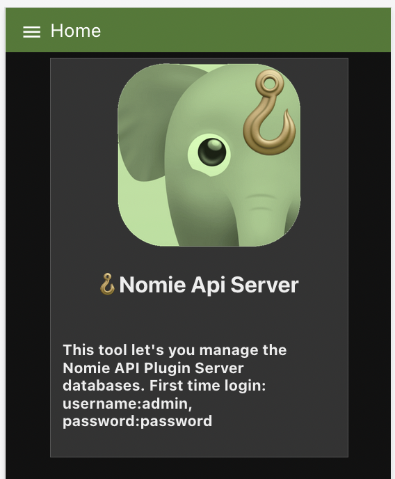
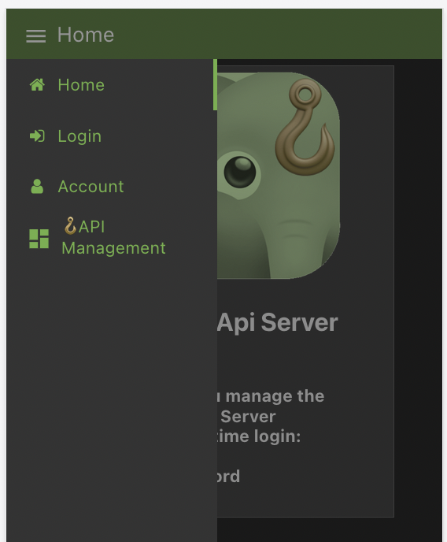
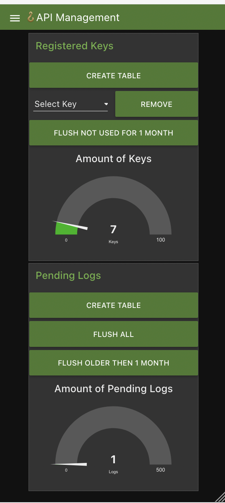

# Nomie API Server

The Nomie API Server is the backend server which is needed in combination with the 🪝Nomie API Plugin for Nomie6-oss.

## About the Nomie API Server

The Nomie API Server provides the backend API functionality which enables the 🪝Nomie API Plugin to function.

The 🪝Nomie API Plugin documentation and installation instructions can be found at:

[https://github.com/RdeLange/nomie-plugin-api](https://github.com/RdeLange/nomie-plugin-api)

## Installing the API Server

The API server has been coded using Node-Red. I am fully aware that there are far better ways of creating such a server capability, but I like to learn and Node-Red came on my learning journey.

### Install on Node_Red Instance

If you would like to run the server on your own Node-Red instance, please make sure to install the following nodes:

* node-red-node-sqlite
* node-red-dashboard
* node-red-contrib-twin-bcrypt
* node-red-contrib-moment

After installing above nodes you can simplu import the flows.json file.

### Install via Docker

I have created a predefined docker image which you can use. Please follow below instructions to get the docker container going:

```text
docker run -v /host/path:/container/path:/home -p 1880:1880 rdelange/dailynomie-apiserver
```

Where '/host/path' is referring to an accesable path on your environment to persist data.

### Install via Docker compose / Portainer stack

You can use the following code:

```text
version: '3'
services:
 nomieapiserver:
  image: rdelange/dailynomie-apiserver:latest
  container_name: dailynomie-apiserver-docker
  volumes:
   - /host/path:/home
  ports:
      - "1440:1880"

```

Again, change the '/host/path' to an accesable path on your environment to persists data.

### Building your own docker image

You can also build your own docker image using the Dockerfile. If you would like to do so, I refer to the docker documentation on how you can do so.

### Acces to the Node-Red flow Editor

Only when you build yourself your own docker image you can provide yourself access to the Node_Red flow editor to visually adjust the code. If you would like to have access to the Node-Red flow editor on your server, please make sure to adjust the credentials in the settings.js file before creating your own docker image. I refer to the Node_Red documentation on how to adjust the credential settings using the Node-Red encryption tools.

## Using the Server

You can reach the server GUI by using your domain, followed by /ui (example: https://api.mydomain.com/ui)

You will be provided with the following screen:



The default login codes are given in above introduction screen, please change them immediately to prevent easy login by others.....

### Change your credentials

You can chage your credentials by logging in with the default credentials via the Log In option at the menu at the left top corner:



Once you have changed your credentials and logged on again with your new password, you can enter the server dashboard by choosing the API Management option in the menu.

### The API Server Dashboard

The API server dashboard consists of 2 sections:

* Managing the registered keys
* Managing the pending logs




For both sections you have the option to create the backend database table. When everything is running fine you should not have to use this option as the databases are automatically setup when the server is deployed.

You can remove individual keys or flush all keys which are not used for longer then a month.

For the pending logs you have the option to flush them all or only the logs older then a Month.

In the future I might add some additional management options, but as the server is intended to be self hosted for you / your family / your friends, these simple options should be enough.

### Managing accounts

If you want to co-manage the server with somebody else, you have the option to give other users access to the server. You can do this via the account section in the menu.

Please be aware that this is a very simple implementation of account management. It works, but as this server is intended to be privately hosted with limitted usage and workload it is not likely that this section will be further developped in the future.

### Why Node-Red

I mentioned above that this server is build using Node-Red. I am fully aware that there are much better ways of implementing the same functionality, but I like to experiment and learn...and this was one of these journies.

Have fun with it!
